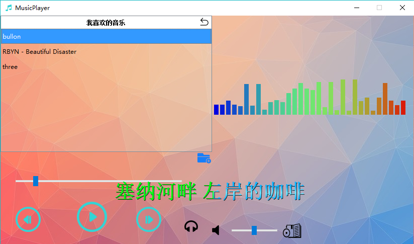

# 1. OVERVIEW
*MusicPlayer*, as its name reveals, is a gorgeous **wav** music player based on **Qt** libraries and 
equiped with **lyric** and **spectrum** display*.
As a homework assigned in the **object-oriented program design** course for sophomore majoring in CS,
it is a **teamwork project** for **non-comercial** purposes.
This system allows you to play music or songs of wav format in the environment which supports some Qt libraries
(since we only compile it in dynamic way).
If the songs has its lyrics file (*.lrc) in the same folder as it, the lyrics can also be shown simultaneously.  
The overall interface can be refered to the following snapshot.  

  

# 2. FUNCTIONS
 

# 3. ARCHITECTURE

# 4. USAGE
Make sure that the consistence of relative paths among all the folders.
##  The hierarchy of the file:
- MiniSQL: source code
- catalog: catalog files
- record: record files
- index: index files
- execFile: files that can exec in MiniSQL
- images: images used in readme  

## How to build the project

##  Sample operations:

  
# 5. LICENSE
The content of all the codes are supposed to use a licence [AGPLv3](./LICENSE)  

# 6. HOW TO CONTRIBUTE
1. Learn what is a AGPLv3, if you have not yet done so (see details above).  
2.  Create your change to the repo in question.
- Fork the desired repo, develop and test your code changes.
- Ensure that your code is clear and comprehensible.
- Ensure that your code has an appropriate set of unit tests which all pass.
3. Submit a pull request.
4. The repo owner will review your request. If it is approved, the change will be merged. If it needs additional work, the repo owner will respond with useful comments.

# 7. DECLARATION
We hereby declare that all the work done in this project titled "Music player" is of our independent effort as a group.  
All the team members are: Zhifeng Jiang(Samuel Gong), Weinan Huang, Yifei Yang, Mingqi Yi and Mingchun Zhong.

# 8. CREDIT
We would like to extend my sincere gratitude to my supervisor, Lanqing Hu, for her instructive advice and useful suggestions on our learning on object-oriented program design.   
